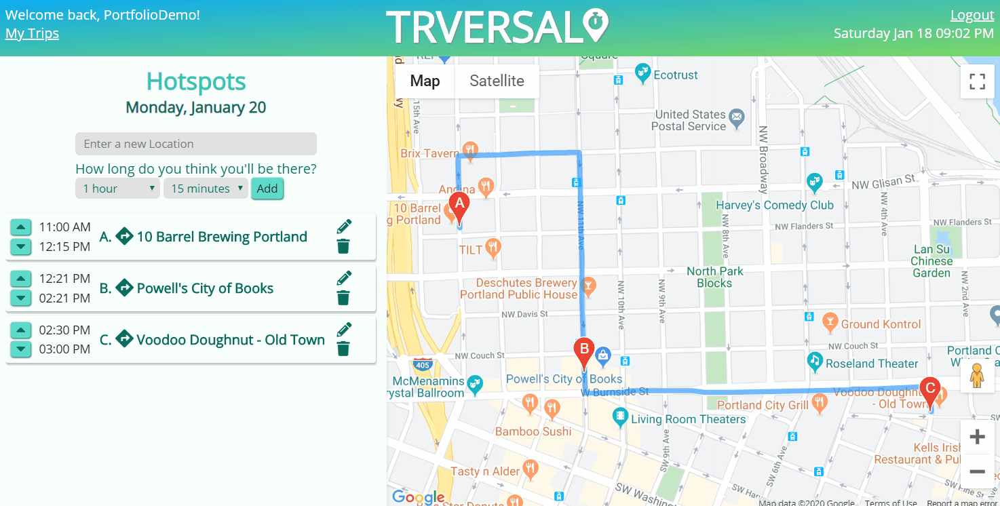

### <a href="http://trversal.com">Trversal.com</a> is an itenerary building web application.  
This app dynamically interacts with Google Maps to calculate the most up to date travel times between your selected locations. Start a trip and add the points of interest you would like to see each day. The app will keep track of the time needed throughout the day to travel between each place so you can realistically see how much you can fit into your trip and stay on schedule!  

There is a demo account log-in available at the bottom of this README.

### Trversal.com v.1



## Future of the Project

**v.2** will re-work the app to use the VUE CLI to build a single page application.

**v.3** will bring a responsive design. This app will be the most useful on a mobile device. 

***


# How to Download and Run Trversal:

If you would like to run trversal on your local server instead of at trversal.com, please follow this guide.  

-You will need a Google API key, and the required Credentials listed below need to be turned on or some features will not work  

-terminal code snippets are Windows examples

***

### Google API Services

You will need to setup an API Key for the Google services.  

*I will attempt to give a quick guide on this, but the site may change. Also, there are just a lot of tools on the cloud service, but there are a lot of  more in-depth guides available online. (I had to use one the first time!)*

1. You will start here: https://cloud.google.com/  
2. Sign-in to a Google account and then go your "Console" that is linked in the header.  
3. You will need to start a new project.  
4. Once in that project's dashboard, look for "API's & Services."  
5. Then click "Credentials."  
6. "Create New Credentials"  
7. Select "API Key" to generate a key and select "Restrict this API key."  
8. In the project menu, look for "Library."  
9. Search and 'enable' the following services:

   -Directions API  
-Maps JavaScript API  
-Geocoding API  
-Places API  

***

### Running the App

This project uses virtual environments with pipenv. With pipenv installed, create the virtual environment:

```bash
pipenv shell
```

'Sync' to install the project's dependencies:

```bash
pipenv sync
```

We need to create a secrets file to hook up the API key

```bash
cd trversalapp

touch secrets.py

nano secrets.py
```
Add the following line of code in the editor. This must be exact or Python won't find the variable. Put **_your api key_** in the quotes:
```python
api_key = "YOUR-KEY"
```

If you are not serving on localhost:8000, the AJAX urls will fail. 
```bash
python manage.py runserver localhost:8000
```

Go to http://localhost:8000/ in your browser.


You can sign into the Demo Account I created:

Username: PortfolioDemo  
Password: dem0Password

Once signed in, to test if your API key is working properly, go to http://localhost:8000/trip/3/ and check to see that the map and route is displayed. 

```bash

```

